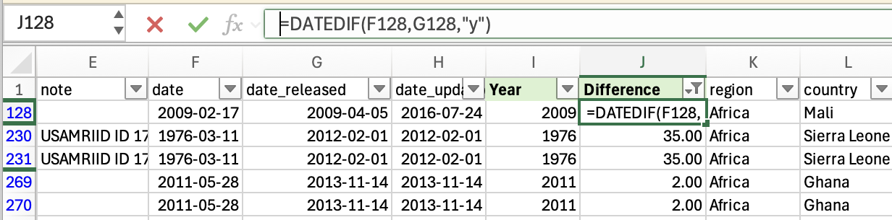
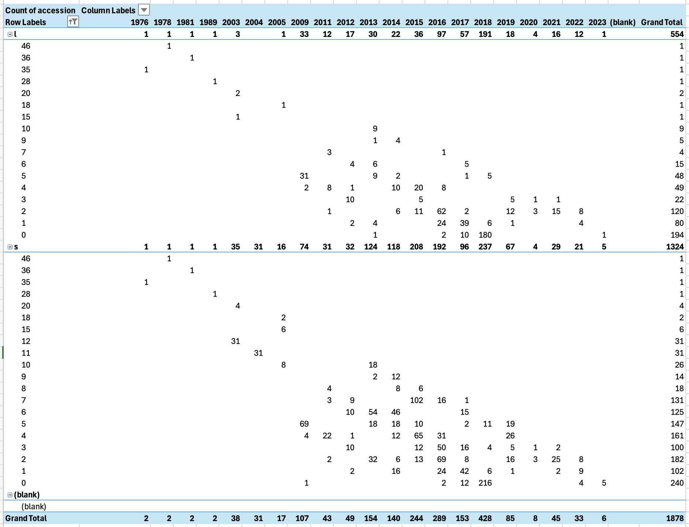
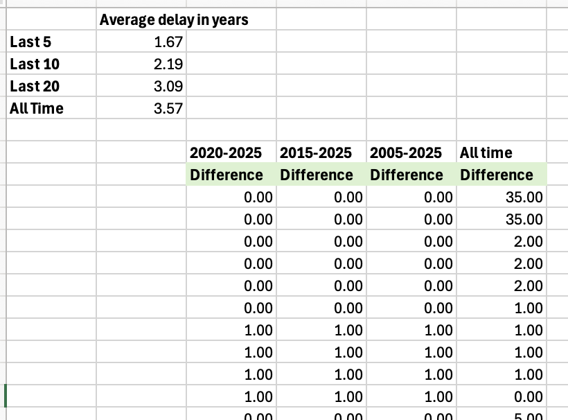

# check-sampling-to-submission-calculation

Check sampling to submission calculation for Lassa samples

```bash
wget https://data.nextstrain.org/files/workflows/lassa/all/metadata.tsv.zst
zstd -d metadata.tsv.zst
```

Open in Excel, move columns `date_released` and `date_updated` next to "date. Compute a new `Year` and `Difference` columns



Create a quick pivot table as a sanity check for delay between collection date and date_released



Yup, as time goes on, the delay between collection and release gets smaller (angle down) regardless of S or L segment (avoid double counting).

Rough check of average delay in the last 5, 10, 20 years and all time. Not fit to any model, just counting. A model method may account for more uncertainty and be more accurate. This is only a sanity check.

